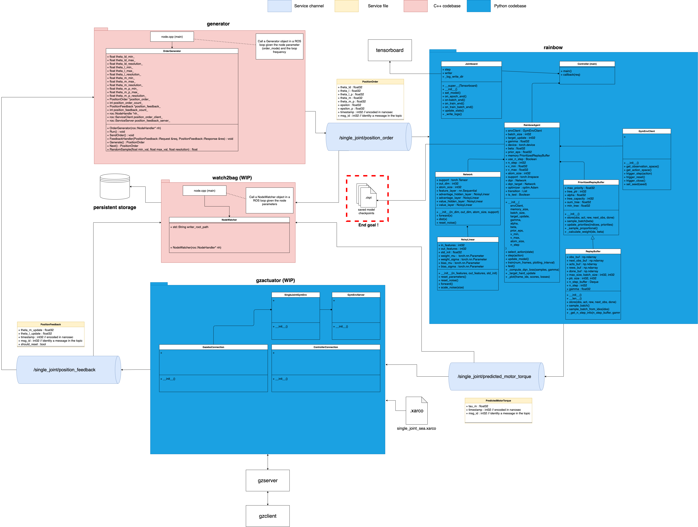

# The "Serpens" project


This repository intend to simulate a snake robot called "Serpens" described [here](https://openarchive.usn.no/usn-xmlui/handle/11250/2650494)).
In that matter,  we will make use of the Robotic Operating System (ROS) to develop the different system nodes. The snake itself, will be simulated inside **Gazebo**, a powerful physic engine which integrate extremely well with the ROS API.

## The goal

The ultimate goal that we agreed on so far is the **snake locomotion** : given a point A (robot starting point) and a point B (robot destination) on a plane, make the snake move itself to reach point B.

Moving a snake robot in the right direction is not as easy as controlling the wheels of a car in order to make it move. Actually, because we don't have a strong background in applied physic or mathematics or either because the task is simply too complex, we don't know the needed control rules for the snake locomotion...  

So, how do we do it ? First we need to split this problem in two parts which are described bellow and then we may have a beginning of a solution.

## Challenge 1 : The joint module.

The basic movement unit is a joint module as described in the paper. We thus need a reliable way to control its angular position. 

After many thoughts, we considered using a **Series Elastic Actuator(SEA)** [for multiple reasons](https://www.intechopen.com/books/recent-advances-in-robotic-systems/series-elastic-actuator-design-analysis-and-comparison).

Those kind of joint are usually controlled using complex PID logics like the fuzzy PID and its intricated rules... Although we are not good in finding those rules because it requires a high amount of knowledge in physics and it also depends on the snake environment, we chose a entirely different path both to try to make a breakthrough and also because we believe it will behave better in much more environments.

We chose to reproduce the non-linear function of such PIDs using a neural network. Using a subset of Reinforcement Learning (RL) called **Q-Learning** (approximate the Q-value function in Markovian Decision Processes. I recommend watching [this](https://www.youtube.com/watch?v=9g32v7bK3Co&t=4305s) and [this](https://www.youtube.com/watch?v=HpaHTfY52RQ&t=161s) to fully grasp the idea behind Q-learning), we hope to make a joint "learn" to apply the right motor torque to face any situation given an angular order.

The model of a joint (the weights of the trained neural network) are incrementally updated and saved to be reused as an **inference** module for what's coming in Challenge 2. 

## Challenge 2 : Coordinate the joint modules

Now that a joint is trained, it is time to coordinate their angular positions through the time in order to create a **serpentoid** curve.

How do we coordinate the joints ? In the original paper, the robot is meant to be used with a dozen of joints but it could be more or less than that. We roughly know the mathematical shape of a snake curve, but like every animals, a snake can adapt to unknown situations because it benefited from million of years of evolution. We chose to do the same : teach the snake how to move every joints at every timesteps (determined by the snake refreshing frequency) given a direction order and a set of torque constraints.

For that purpose, we will use another particular Reinforcement Learning algorithm (this time based on **Policy Gradient**) called Advantage Asynchronous Actor-Critic Network (A3C). It was theorized in 2016 by Google's DeepMind team. You can find the paper [here](https://paperswithcode.com/method/a3c).

A3C basically teach multiple agents (a single joint) how to behave asynchronously given a global policy, reward and environment. This global agent if often called a **meta-agent**.

The **inference** phase of a single joint come then right after a set of output (a vector with all the angular positions of each joint a time t) given by A3C. The joint are then updated and the process continue. The error criterion is measured and the global policy is then adapted just like every RL algorithm. 

## High level architecture

* **single_joint** ROS package
    
    

* **locomotion** ROS package

    (WIP)

## Filesystem architecture

```
doc/                           (Where is the documentation ; pictures, texts etc.)
requirements/                  (External Python libraries list to install in the virtual env)
results/                       (The place where are the simulation results)
|   notebooks/                 (Jupyter Python notebooks for offline analysis)
|   rl_model_ckpts/            (Place where are saved the .h5 files of the model)
|   single_joint_states/       (.bag/.csv files written by watch2bag node)
serpens/                       (ROS source code)
|   src/                       (catkin src folder)
|   |   locomotion/            (ROS 'locomotion' package ; this is Challenge 2 as shown above.)  
|   |   single_joint/          (ROS 'single_joint' package ; this is Challenge 1)
|   |   |   config/            (.yaml files where we have static configs for the nodes)
|   |   |   launch/            (All the .launch files for this package)
|   |   |   scripts/           (The source files of every nodes in this package)
|   |   |   |   generator/     (Sources for the 'generator' node)
|   |   |   |   gzactuator/    (Sources for the 'gzactuator' node)
|   |   |   |   rainbow/       (Sources for the 'rainbow' node)
|   |   |   |   watch2bag/     (Sources for the 'watch2bag' node)
|   |   |   |   generator.py   (executable for the 'generator' node)
|   |   |   |   gzactuator.py  (executable for the 'gzactuator' node)
|   |   |   |   rainbow.py     (executable for the 'rainbow' node)
|   |   |   |   watch2bag.py   (executable for the 'watch2bag' node)
|   |   |   srv/               (The Service definitions for this package)
|   |   |   urdf/              (The URDF files like .xacro of this package)
|   |   |   CMakeLists.txt     (How to bo build this package)
|   |   |   package.xml        (Package description and dependencies)
    
```

## How to run the single_joint simulation

* In one terminal launch the `roscore` command
* In an other terminal, go to `serpens-project/serpens` and `catkin_make` and then `source devel/setup.sh`
* Finally, type `roslaunch single_joint simulation.launch`

## Coding convention for the contributors

* For Python codebase, try to follow the [Google Python Style Guide](https://google.github.io/styleguide/pyguide.html)